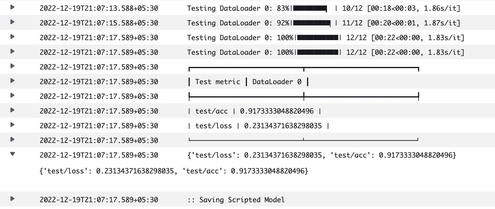
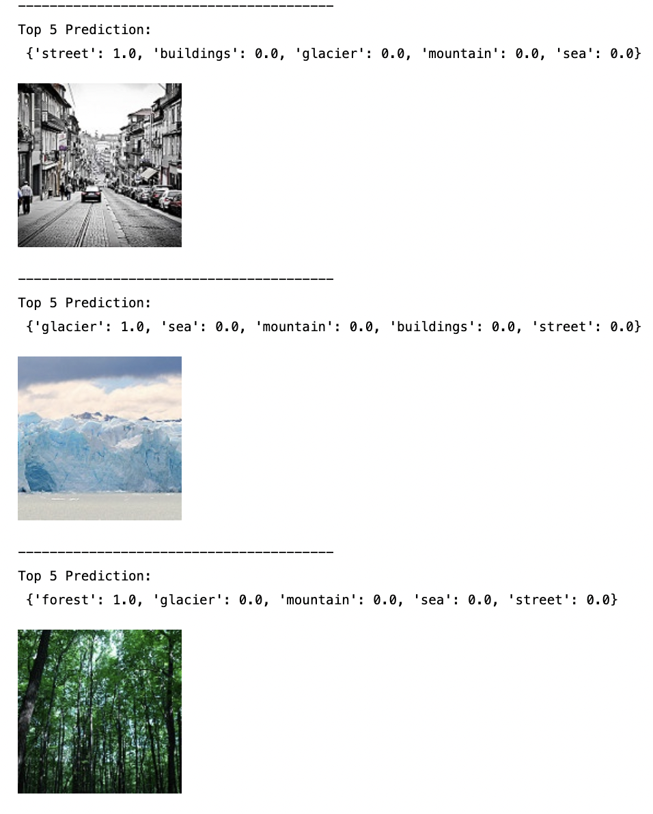
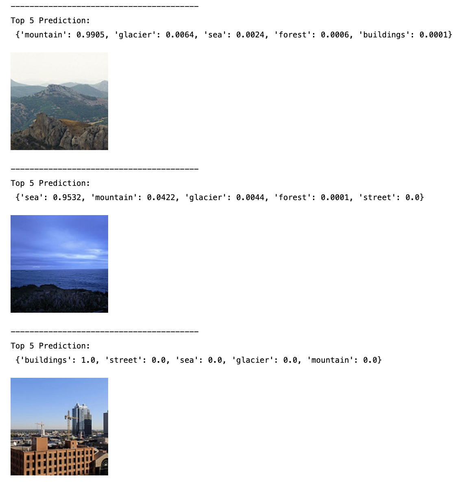
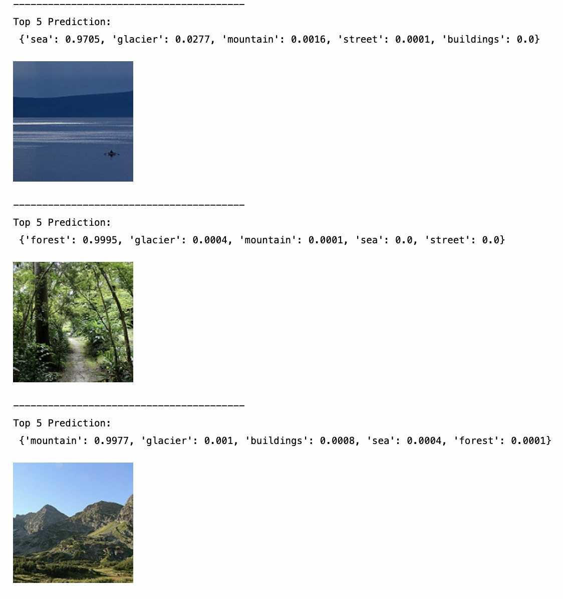
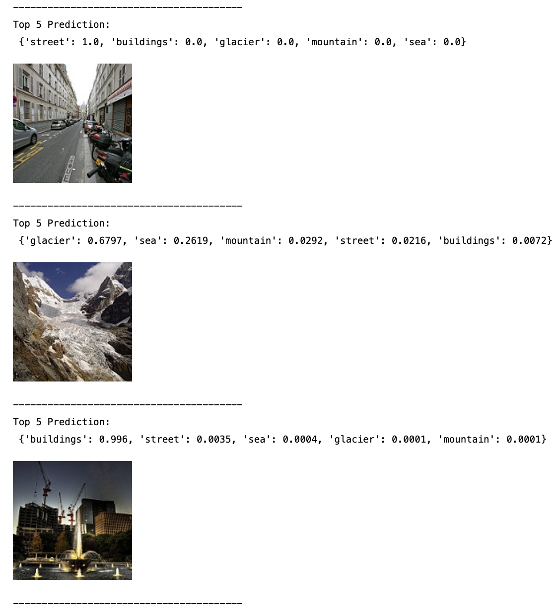

# Image Classification (Preprocess, Train & Deploy) in AWS Sagemaker
A simple end to end Image Classification (preprocessing, training, deployment) using AWS Sagemaker. 

NOTE : Using pipeline is in different repo.

## Steps to Preprocess, Train & Deploy
1. Upload data file in .zip (data source https://www.kaggle.com/datasets/puneet6060/intel-image-classification) to S3.
```s3://mlops-tutorials/sagemaker-mlops1/intel/```

2. Create a repo in AWS CodeCommit for DVC

3. Run ```setup-git-dvc``` notebook

4. Run ```data-reprocessing``` notebook

5. Run ```train``` notebook

6. Run ```deployAndPredict``` notebook

7. Save JSON file in ```SM_MODEL_DIR``` directory
```
# save eval metrics in json file
    trainer.test(model, datamodule)
    eval_metrics = { k : v.tolist() for k, v in trainer.callback_metrics.items() }
    print(eval_metrics)
    with open((sm_model_dir/"eval_metrics.json"), "w") as jfile:
        json.dump(eval_metrics, jfile)
```

8. Check Cloud Watch logs


## Example of Inference
Top 5 predictions for each image.






## Create Custom Docker image from AWS DLC
Create ```Custom Docker Image``` for Sagemaker Jobs using AWS Deep Learning Containers as base.

#### Why should I extend a SageMaker container?
- Install additional dependencies. (E.g. I want to install a specific Python library, that the current SageMaker containers don't install.)
- Configure your environment. (E.g. I want to add an environment variable to my container.)

#### Permissions
```SageMakerFullAccess``` and ```AmazonEC2ContainerRegistryFullAccess``` to create the custom docker

- how to package a PyTorch container, extending the SageMaker PyTorch container by extending the SageMaker PyTorch container we can utilize the existing training and hosting solution made to work on SageMaker.

- AWS DLC (Deep Learning Containers), choose one of these as base https://github.com/aws/deep-learning-containers/blob/master/available_images.md 

e.g. ```763104351884.dkr.ecr.us-east-1.amazonaws.com/pytorch-training:1.12.1-cpu-py38-ubuntu20.04-sagemaker```

1. Spin up a EC2 instance 
2. Create a requirements.txt with required packages and versions
3. Create a dockerfile file with below contents

```
#Take base AWS DLC container
FROM 763104351884.dkr.ecr.ap-southeast-2.amazonaws.com/pytorch-training:1.12.1-cpu-py38-ubuntu20.04-sagemaker

COPY requirements.txt requirements.txt

RUN pip3 install -r requirements.txt \
    && rm -rf /root/.cache/pip

```
4. Create a repo in ECR, copy build commands

5. From EC2 terminal LOGIN : ()
```aws ecr get-login-password --region ap-southeast-2 | docker login --username AWS --password-stdin 763104351884.dkr.ecr.ap-southeast-2.amazonaws.com```

6. Then Build DOCKER ```docker build -t custom-pytorch-cpu-sagemaker .```

7. After the build is completed, tag your image so you can push the image to this repository:
```docker tag custom-pytorch-cpu-sagemaker:latest 536176424191.dkr.ecr.ap-southeast-2.amazonaws.com/custom-pytorch-cpu-sagemaker:latest```

8. Then again login to ```aws ecr get-login-password --region ap-southeast-2 | docker login --username AWS --password-stdin 536176424191.dkr.ecr.ap-southeast-2.amazonaws.com```

9. Run the following command to push this image to your newly created AWS repository:
```docker push 536176424191.dkr.ecr.ap-southeast-2.amazonaws.com/custom-pytorch-cpu-sagemaker:latest```

Refer [Building AWS Deep Learning Containers Custom Images](https://docs.aws.amazon.com/deep-learning-containers/latest/devguide/deep-learning-containers-custom-images.html)

## Tensorboard Logs

1. Go to terminal and check for tensorboard, if not present then install
```pip install tensorboard```

2. Run ```tensorboard --logdir <s3 URI of logs>```
e.g.
```
tensorboard --logdir s3://sagemaker-ap-southeast-2-536176424191/sagemaker-intel-classification-logs/training-intel-dataset-2022-12-15-15-44-51-564/tensorboard-output/
```

3. Upload to TensorBoard.dev

 - Uploading the TensorBoard logs will give you a URL that can be shared with anyone.
 - Uploaded TensorBoards are public, so do not upload sensitive data.
 - The uploader will exit when the entire logdir has uploaded. (This is what the --one_shot flag specifies.)

```
tensorboard dev upload --logdir s3://sagemaker-ap-southeast-2-536176424191/sagemaker-intel-classification-logs/training-intel-dataset-2022-12-15-15-44-51-564/tensorboard-output/ \
--name "Intel image Classification" \
--description "git link here" \
--one_shot
```

## Link to Tensorflow Dev : 
https://tensorboard.dev/experiment/Ry8FY2MvTr2CaM15k2ikwA/#scalars


# References : 
1. https://docs.aws.amazon.com/sagemaker/latest/dg/build-your-own-processing-container.html

2. https://github.com/aws/amazon-sagemaker-examples/blob/main/advanced_functionality/pytorch_extending_our_containers/pytorch_extending_our_containers.ipynb

3. AWS DLC (Deep Learning Containers), choose one of these as base https://github.com/aws/deep-learning-containers/blob/master/available_images.md

4. Custome Docker Image https://docs.aws.amazon.com/deep-learning-containers/latest/devguide/deep-learning-containers-custom-images.html

5. Setup for HTTPS users using Git credentials 
https://docs.aws.amazon.com/codecommit/latest/userguide/setting-up-gc.html?icmpid=docs_acc_console_connect_np